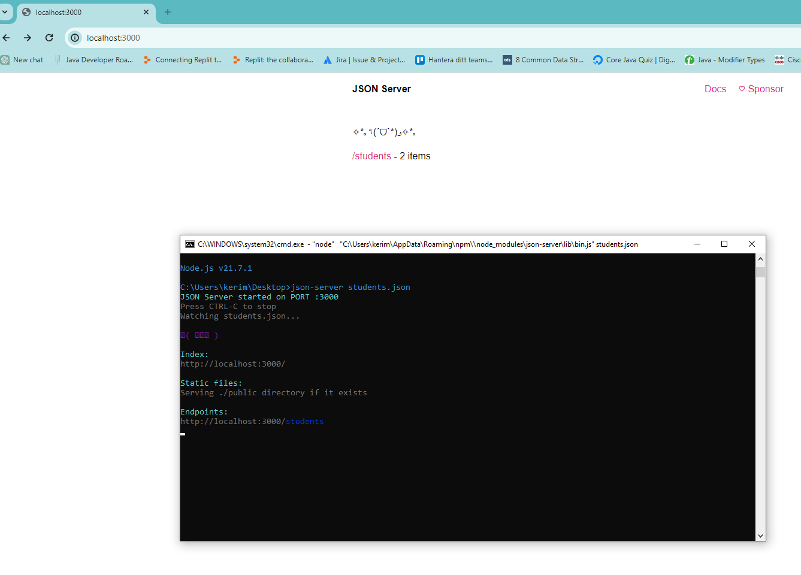
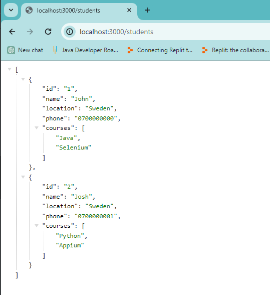
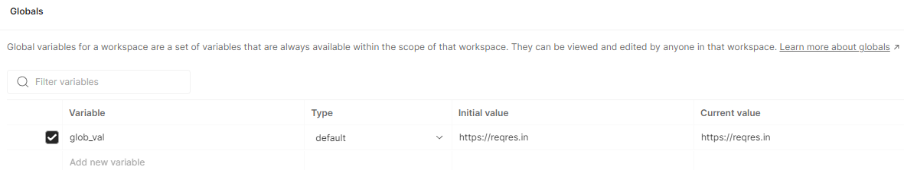
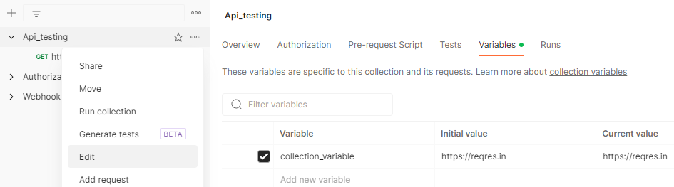
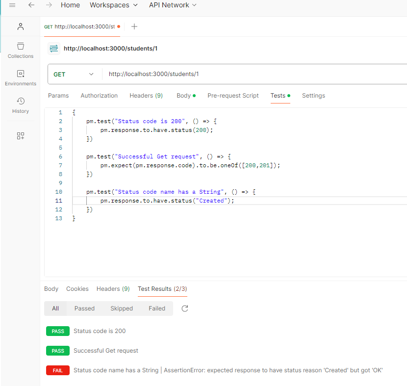

# Node

- [Node](#node)
- [Tools](#tools)
- [Environment](#environment)
- [Tests](#tests)

## Node
* Node.js is an open-source, cross-platform, JavaScript runtime environment that executes JavaScript code outside a web browser.

## JSON Server
* JSON Server is a full fake REST API with zero coding in less than 30 seconds.

### Installation - Using Chocolatey in powershell

```bash
choco install nodejs # Install Node.js in powershell
npm install -g json-server # Install JSON Server in CMD
json-server students.json # Run JSON Server with the local file students.json
```

# Postman
Get - http://localhost:3000


Get - http://localhost:3000/students



# Tools
https://jsonpathfinder.com/ # JSON Pathfinder

https://jsonpath.com/ # JSON Path

# Environment
## Global variable
You can create a global variable in Postman by clicking on the eye icon in the top right corner of the Postman window.
There you create the name of the global variable and set the value to an adress

```bash
{
   GET {{[global_name]}}/api/v1 # Example
}
```



## Collection variable 
Accessable only in the specified collection

```bash
{
    GET {{[collection_name]}}/api/v1 # Example
}
```



## Environment variable
Accessable in all collections but only in the specified environment

```bash
{
    GET {{[collection_name]}}/api/v1 # Example
}
```


# Tests
## Status codes
```bash
{
    pm.test("Status code is 200", () => {
        pm.response.to.have.status(200);
    })

    pm.test("Successful Get request", () => {
        pm.expect(pm.response.code).to.be.oneOf([200,201]);
    })

    pm.test("Status code name has a String", () => {
        pm.response.to.have.status("Created");
    })
}
```

  

## Headers
```bash
{
    pm.test("Content-Type header is present", () => {
        pm.response.to.have.header("Content-Type");
    })

    pm.test("Content-Type header is application/json", () => {
        pm.expect(pm.response.headers.get("Content-Type")).to.eql("application/json");
    })

}
```

## Cookies
```bash
{
    pm.test("Cookie 'language' is present", () => {
        pm.expect(pm.cookies.has("language")).to.be.true;
    })

    pm.test("Cookie language a value 1", () => {
        pm.expect(pm.cookies.get("language")).to.eql("en-gb");
    })

    pm.test("Cookie has a specific value", () => {
        pm.expect(pm.cookies.get("cookie_name")).to.eql("cookie_value");
    })

}
```

## Response time
```bash
{
    pm.test("Response time is less than 200ms", () => {
        pm.expect(pm.response.responseTime).to.be.below(200);
    })
}
```

## Response body
```bash
{
    pm.test("Test data type of the response", () => {
        const jsonData = pm.response.json();
        pm.expect(jsonData).to.be.an("object");
        pm.expect(jsonData.name).to.be.a("string");
        pm.expect(jsonData.id).to.be.a("number");
        pm.expect(jsonData.curses).to.be.an("array")
    })
}
```

## Response body - Array
```bash
{
    pm.test("Test data type of the response", () => {
        const jsonData = pm.response.json();
        pm.expect(jsonData).to.be.an("array");
        pm.expect(jsonData.courses).to.include("Java")
        pm.expect(jsonData.courses).to.have.members(["Java", "Python", "C++"])
    })
}
```