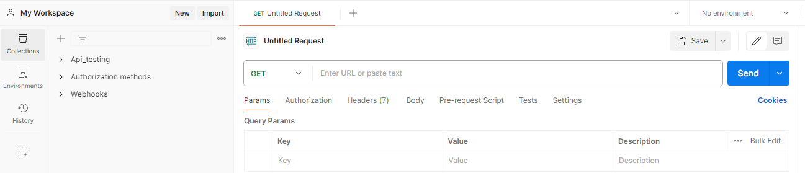

# Postman

- [Collection](#collection)

# Collection
- A collection is a group of saved requests that can be organized into folders.
- Collections can be exported and shared with others.
- Collections can be used to group related requests together, making it easier to manage and organize your API calls.

